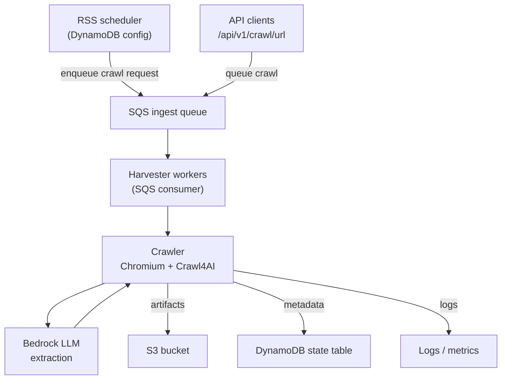

# Harvester at a Glance

The harvester is a news article collection and extraction system that automatically discovers, crawls, and processes web content from various news sources. Think of it as an intelligent web scraper that not only downloads articles but also understands and extracts structured information from them using AI.

## How the Harvester Works

The harvester operates through several coordinated components working together:

### 1. Authentication Management
The harvester maintains a fresh authentication token for AWS Bedrock (Amazon's managed AI service). Because Bedrock tokens expire after a certain period, a background task continuously monitors and refreshes this token before it becomes invalid. This ensures that when the crawler needs to call the AI model to extract article data, it always has valid credentials ready to use.

### 2. Work Discovery and Queueing
The system discovers work to do in two ways:
- **RSS Feed Monitoring**: It periodically checks DynamoDB for configured RSS feed sources
- **Direct API Requests**: It accepts one-off crawl requests through the REST API endpoint

Once a URL needs to be crawled (whether from an RSS feed or API request), the harvester places that crawl job into an AWS SQS (Simple Queue Service) queue. This queue acts as a reliable buffer between incoming requests and the actual crawling work.

### 3. Distributed Work Processing
A pool of worker processes continuously monitors the SQS queue for new crawl jobs. When a worker picks up a job, it:
- Launches a Chromium browser instance using Crawl4AI (a specialized web crawling framework)
- Navigates to the target URL and waits for the page to fully load
- Captures the complete page content, including any dynamically rendered JavaScript elements

### 4. AI-Powered Content Extraction
For each crawled page, the harvester uses AWS Bedrock's large language model (LLM) to intelligently extract structured information. Instead of relying on brittle CSS selectors or HTML parsing rules that break when websites change, the AI analyzes the page content and identifies:
- Article title
- Main article body text
- Publication date
- Relevant keywords and topics

This AI-driven approach is much more resilient to website layout changes and works across different news sites without custom configuration.

### 5. Storage and Tracking
After extraction, the harvester stores the results in multiple locations:
- **Raw artifacts** (HTML, PDF, extracted JSON) are saved to Amazon S3 for long-term storage
- **Metadata** (crawl status, timestamps, S3 paths, extraction results) is recorded in DynamoDB for fast querying
- **Processing records** are maintained in the local filesystem or S3, depending on configuration

This dual storage approach allows for both efficient searching (via DynamoDB) and complete historical archives (via S3).

## Understanding AWS Bedrock's Role

AWS Bedrock serves as the intelligence layer of the harvester, transforming raw HTML into meaningful, structured data.

### How It Works
When Crawl4AI fetches a webpage, it receives potentially thousands of lines of HTML, CSS, and JavaScript. Rather than writing complex parsing logic for each different news website, the harvester sends this raw content to Bedrock's large language model along with specific instructions about what information to extract.

The LLM reads through the page content just like a human would, identifying the article's key components regardless of how the HTML is structured. This is accomplished through Crawl4AI's `LLMExtractionStrategy`, which:
1. Formats the page content into a prompt for the AI model
2. Specifies the exact data schema we want (title, body, date, keywords)
3. Sends the request to Bedrock using the configured model ID (such as Claude or another foundation model)
4. Receives back a structured JSON response with the extracted fields

### Token Management
Because AWS Bedrock requires authentication for each API call, and because these authentication tokens expire periodically, the harvester runs a dedicated background task that:
- Monitors the current token's expiration time
- Proactively requests a new token before the old one expires
- Shares this refreshed token across all concurrent crawl requests

This ensures that crawler workers never fail due to expired credentials, even during long-running batch operations.

## Scaling the Harvester

Understanding how to scale the harvester is important as your crawling needs grow. The architecture uses several AWS services, each with different scaling characteristics.

### The SQS Queue as a Buffer
Amazon SQS acts as a shock absorber between incoming crawl requests and the workers that process them. When you receive a sudden burst of articles to crawl (perhaps a dozen RSS feeds all updated at once), SQS reliably holds all these jobs until workers are available to process them.

To increase throughput, you have several options:
- **Add more harvester containers**: Deploy additional instances of the harvester application, and each will independently consume messages from the shared SQS queue
- **Increase concurrency per process**: The current implementation uses a semaphore that limits each harvester process to one crawl at a time. You can adjust this semaphore to allow multiple concurrent crawls per process, though you'll need to ensure your server has sufficient memory and CPU to run multiple Chromium instances simultaneously
- **Hybrid approach**: Run multiple containers with moderate concurrency settings for each

### Storage Services
It's important to understand that S3 and DynamoDB don't automatically scale up just because your SQS queue is growing. These are managed services that handle scaling internally, but you still need to:
- **Monitor DynamoDB**: Watch for throttling errors and adjust read/write capacity if using provisioned mode (or use on-demand mode for automatic scaling)
- **Monitor S3**: While S3 itself scales automatically, you should watch for rate limiting if you're writing thousands of objects per second to the same prefix
- **Watch costs**: As throughput increases, so do your AWS bills for storage, data transfer, and DynamoDB operations

## Monitoring and Debugging

The harvester provides several ways to observe what's happening and troubleshoot issues.

### Application Logs
The most direct way to see what the harvester is doing is through its logs:
- **Docker deployment**: Run `docker-compose logs -f harvester` to follow the logs in real-time
- **Local development**: The harvester outputs logs to your terminal as it runs

These logs show each crawl attempt, extraction results, errors, and background task activities.

### API Endpoints for Observability
The harvester exposes several HTTP endpoints that let you inspect its current state:

- **Queue status**: `GET /api/v1/sqs/status` shows how many messages are waiting in the queue and how many workers are active
- **Queue control**: Use `GET /api/v1/sqs/pause` to temporarily stop processing new messages (useful during maintenance) and `GET /api/v1/sqs/resume` to restart processing
- **Bedrock token**: `GET /api/v1/bedrock/token` returns the current authentication token (useful for debugging authentication issues, but should not be exposed in production)

### AWS Service Inspection
You can also directly query the underlying AWS services using the AWS CLI:

- **SQS**: `aws sqs receive-message --queue-url <your-queue-url>` lets you peek at pending messages without removing them from the queue
- **DynamoDB**: `aws dynamodb scan --table-name <your-table-name>` retrieves all crawl records (though for large tables, you should use query operations with specific filters)
- **S3**: `aws s3 ls s3://<your-bucket-name>/` shows all stored artifacts

These CLI commands are particularly useful when troubleshooting why certain articles didn't process correctly or when auditing what data the harvester has collected.

## Automated RSS Feed Monitoring

One of the harvester's key features is its ability to automatically monitor RSS feeds and discover new articles without manual intervention. This section explains how and why this works.

### Why RSS Feeds Are Stored in DynamoDB

News websites constantly publish new articles throughout the day. Rather than manually submitting each article URL for crawling, the harvester maintains a list of RSS feed URLs in DynamoDB. This approach offers several advantages:

- **Persistence**: Feed configurations survive application restarts and can be shared across multiple harvester instances
- **Dynamic updates**: You can add, remove, or modify feed configurations without redeploying the application
- **Metadata storage**: Each feed record includes not just the URL, but also associated tags (for categorization), limits (maximum articles to fetch per check), and other settings
- **Queryability**: DynamoDB allows fast lookups and updates of feed configurations

### How the RSS Scheduler Works

The harvester runs a background scheduler that operates on a fixed interval (approximately every 10 minutes). Here's what happens during each cycle:

1. **Read feed configurations**: The scheduler queries DynamoDB to retrieve all configured RSS feeds. Each record contains:
   - The RSS feed URL (e.g., `https://example.com/feed.xml`)
   - Tags to apply to articles from this source (e.g., `["technology", "AI"]`)
   - Maximum number of articles to process per check
   - Last check timestamp (to avoid reprocessing old articles)

2. **Fetch each feed**: For every configured feed, the scheduler makes an HTTP request to fetch the RSS XML. RSS feeds are standardized XML documents that list recent articles with their URLs, titles, and publication dates.

3. **Identify new articles**: The scheduler parses the RSS XML and extracts article URLs. It compares these against previously processed articles (tracked in DynamoDB) to identify which ones are new.

4. **Create crawl jobs**: For each new article URL, the scheduler creates a crawl request message containing:
   - The article URL to crawl
   - Source tags from the feed configuration
   - Any additional metadata

5. **Enqueue for processing**: These crawl request messages are sent to the SQS queue, where they wait to be picked up by harvester workers (the same workers that process API-submitted crawl requests).

### Setting Up RSS Feed Configurations

There are two ways to configure which RSS feeds the scheduler should monitor:

1. **API endpoint**: Send a POST request to `/api/v1/crawl/rss` with the feed URL, tags, and limits. This creates a new record in DynamoDB.

2. **Bulk import**: The harvester includes a helper script that reads `harvester/harvester_scrape_config.json` (a JSON file containing multiple feed configurations) and imports all of them into DynamoDB at once. This is useful for initial setup or when migrating configurations.

### Why Periodic Checking Is Necessary

RSS feeds don't "push" notifications when new content is published. Instead, the harvester must periodically "pull" (fetch) each feed to check for updates. The 10-minute interval balances two concerns:
- **Timeliness**: New articles are discovered relatively quickly (within 10 minutes of publication)
- **Resource usage**: Fetching feeds too frequently wastes bandwidth and AWS resources, especially if feeds rarely update

If you need more frequent updates for critical sources, you can adjust the scheduler interval in the harvester configuration. Conversely, for low-priority feeds that update infrequently (e.g., weekly blogs), you might consider a longer interval.

### Other Scheduled Tasks

The RSS scheduler is currently the only periodic background job in the harvester. Other background tasks (like Bedrock token refresh) run continuously but only perform work when needed (e.g., when a token is about to expire) rather than on a fixed schedule.

## Process Diagram


---

# Functional Documentation of Core Package

This section provides a comprehensive overview of all modules, classes, methods, functions, and attributes in the `core/` folder.

## 1. config.py

**Purpose**: Centralized configuration management using Pydantic settings with environment variable support.

This module acts as the single source of truth for all application settings. Instead of hard-coding configuration values throughout the codebase, this module reads them from environment variables (typically stored in a `.env` file) and validates them using Pydantic. This makes it easy to change settings between development and production environments without modifying code.

### Classes

#### `SharedSettings(BaseSettings)`
Base configuration class with settings shared across all services.

This class defines configuration that is common to all parts of the application (harvester, verifier, etc.). It inherits from Pydantic's `BaseSettings`, which automatically loads values from environment variables and validates their types. Think of this as the "common config" that everything needs.

**Attributes:**

**AWS Authentication & Regional Settings:**
- `aws_region: str | None` - AWS region where your resources are located (default: "eu-central-1"). This tells AWS which geographic data center to use for services like S3, SQS, and DynamoDB. Different regions can have different pricing and latency characteristics.
- `aws_access_key_id: str | None` - AWS access key ID for authentication. This is like a username for programmatic access to AWS services. Usually not needed if running on AWS infrastructure (EC2, Lambda) since those use IAM roles.
- `aws_secret_access_key: str | None` - AWS secret access key for authentication. This is like a password that pairs with the access key ID. Should be kept secret and never committed to version control.
- `aws_session_token: str | None` - AWS session token for temporary credentials. When using temporary security credentials (common with IAM roles), this token is required alongside the access key to prove the credentials are still valid.

**API Server Settings:**
- `api_host: str | None` - API server host address (default: "0.0.0.0"). The IP address the web server listens on. "0.0.0.0" means "accept connections from any network interface," which is needed for Docker containers and cloud deployments.
- `api_port: int | None` - API server port number (default: 8000). The TCP port where the FastAPI application accepts HTTP requests. In production, this is often overridden by cloud platforms.
- `debug: bool | None` - Debug mode flag (default: True). When enabled, provides detailed error messages and auto-reloading during development. Should be disabled in production for security and performance.

**Logging Configuration:**
- `log_level: str | None` - Logging verbosity level (default: "INFO"). Controls how much detail appears in logs. "DEBUG" shows everything, "INFO" shows normal operations, "WARNING" only shows potential issues, "ERROR" only shows failures.

**SQS (Simple Queue Service) Settings:**
- `sqs_wait_time: int | None` - SQS long polling wait time in seconds (default: 20). How long to wait for messages when the queue is empty before returning. Long polling (up to 20s) reduces costs and latency compared to rapidly checking an empty queue.
- `sqs_visibility_timeout: int | None` - SQS message visibility timeout in seconds (default: 120). After a worker retrieves a message, this is how long other workers can't see it. If processing takes longer than this, the message becomes visible again and might be processed twice.
- `sqs_aws_region: str | None` - AWS region for SQS (defaults to aws_region). Allows using SQS in a different region than other services if needed, though typically you keep everything in one region for lower latency.

**Bedrock (AWS AI Service) Settings:**
- `bedrock_token_expiry_seconds: int | None` - Bedrock authentication token lifetime (default: 43200 = 12 hours). Bedrock tokens expire for security. This tells the application how long a token is valid before needing refresh.
- `bedrock_aws_region: str | None` - AWS region for Bedrock (defaults to aws_region). Bedrock isn't available in all regions, so you might need to specify a different region than your other services.
- `bedrock_model_id: str | None` - Bedrock LLM model identifier (default: "eu.anthropic.claude-3-7-sonnet-20250219-v1:0"). The specific AI model to use for article extraction. Different models have different capabilities, costs, and availability.
- `bedrock_model_temperature: float | None` - Model temperature controlling randomness (default: 0.1). Lower values (near 0) make the AI more deterministic and focused. Higher values (near 1) make it more creative. For data extraction, low values ensure consistent results.
- `bedrock_model_max_tokens: int | None` - Maximum tokens in AI responses (default: 4096). Limits how long the AI's response can be. Tokens are roughly words or word fragments. This prevents runaway costs and ensures responses fit expected formats.
- `bedrock_model_top_k: int | None` - Number of top token candidates to consider (default: 20). Controls response diversity by limiting which words the AI can choose from. Lower values make output more predictable.

**DynamoDB (NoSQL Database) Settings:**
- `dynamodb_state_table_name: str | None` - DynamoDB table name for crawl state tracking (shared by all agents). This table stores metadata about crawled articles, allowing the system to track what's been processed and where files are stored.
- `dynamodb_rss_processed_table_name: str | None` - DynamoDB table name for RSS deduplication. This table tracks which RSS feed items have already been crawled, preventing the system from re-processing the same article multiple times.
- `dynamodb_task_ttl_secs: int | None` - Time-to-live for DynamoDB records in seconds (default: 86400 = 24 hours). After this duration, DynamoDB automatically deletes old records to save storage costs. Useful for temporary tracking data.
- `model_config: SettingsConfigDict` - Pydantic configuration telling it to load from .env files and ignore case when matching environment variables to settings.

#### `HarvesterSettings(SharedSettings)`
Extended configuration class specific to the harvester service.

This class inherits all the shared settings and adds harvester-specific configuration. By extending SharedSettings, we avoid duplicating common settings while still having a place for harvester-only options.

**Attributes:**
- *Inherits all attributes from SharedSettings* - Includes all AWS, API, logging, SQS, Bedrock, and DynamoDB settings listed above.

**Harvester-Specific Settings:**
- `crawl_save_location: str | None` - Local directory path for storing crawled content (default: "crawled"). This is where article files (JSON, PDF, text) are saved on the server's filesystem before being uploaded to S3.
- `harvester_browser_profile: str | None` - Browser profile directory path (default: "/tmp/browser_profile"). Chromium stores cookies, cache, and session data here. Using a persistent profile can help with sites that require cookies or have anti-bot measures.
- `harvester_config_table: str | None` - DynamoDB table name for harvester task configuration. This table stores the list of RSS feeds and websites to monitor, allowing dynamic configuration without redeploying code.
- `bedrock_model_id: str | None` - Overrides parent setting to use Amazon Nova Pro model (default: "eu.amazon.nova-pro-v1:0"). The harvester uses a different AI model than other services, possibly for cost or capability reasons.
- `harvester_sqs_queue_name: str` - SQS queue name for crawl job ingestion (required field). This is the queue where crawl requests are placed. Workers pull jobs from this queue to process.
- `s3_bucket_name: str` - S3 bucket name for artifact storage (required field). This is the AWS S3 bucket where all crawled files (PDFs, JSON, screenshots) are permanently stored.
- `rss_processing_interval_seconds: int | None` - How often to check RSS feeds in seconds (default: 600 = 10 minutes). The scheduler wakes up this often to fetch all configured RSS feeds and queue new articles.
- `rss_track_processed_urls: bool | None` - Enable URL deduplication tracking (default: True). When enabled, the system remembers which URLs it's already crawled and skips them, preventing duplicate work.

### Module-level Variables
- `settings: SharedSettings` - Global singleton instance of SharedSettings, loaded once when the module is imported. Access this for common settings.
- `harvester_settings: HarvesterSettings` - Global singleton instance of HarvesterSettings, loaded once when the module is imported. Access this for harvester-specific settings.

---

## 2. logging_config.py

**Purpose**: Centralized logging infrastructure with session tracking capabilities.

This module sets up application-wide logging so you can track what the system is doing, diagnose problems, and monitor performance. The key feature is "session tracking" - the ability to tag all log messages from a single API request or crawl job with a unique ID, making it easy to trace the flow of a single operation through the entire system even when processing multiple requests concurrently.

### Context Variables
- `session_id_context: ContextVar[Optional[str]]` - A thread-safe variable for storing session IDs in async contexts. Python's `ContextVar` ensures that each async task maintains its own session ID without interfering with other concurrent tasks, even though they share the same process.

### Classes

#### `SessionLoggerAdapter(logging.LoggerAdapter)`
Logger adapter that prefixes log messages with session IDs.

This wrapper class adds a session identifier to every log message. When you have hundreds of concurrent crawl operations, this prefix lets you filter logs to see just the messages related to one specific crawl job, making debugging much easier.

**Methods:**
- `__init__(self, logger, session_id: str)` - Initialize adapter with base logger and session ID. Creates a logger that will automatically prepend the session ID to all messages.
- `process(self, msg, kwargs)` - Process log message to add session ID prefix format: `[{session_id}] {msg}`. This is called automatically before each log message is written, transforming "Started crawling" into "[abc123] Started crawling".

### Functions

#### `get_session_logger(name: Optional[str] = None, session_id: Optional[str] = None)`
Get a logger with session ID context.

This is the primary function you call to get a logger for your code. If you provide a session ID, all log messages will be tagged with it. If you don't provide one, you get a regular logger without session prefixes.

**Parameters:**
- `name` - Logger name (defaults to module name). Usually pass `__name__` to use the module's name, making it easy to see which file generated each log message.
- `session_id` - Session ID to attach to logs. Typically a unique request ID or job ID that identifies a specific operation.

**Returns:** Logger or SessionLoggerAdapter instance that you can use to call `.info()`, `.debug()`, `.error()`, etc.

#### `setup_logging()`
Configure logging for the entire application.

This function is called once when the application starts. It configures how all log messages are formatted and where they go (console, files, etc.). By centralizing this, we ensure consistent logging across all modules.

**Behavior:**
- Clears existing handlers from root logger to prevent duplicate messages (important when reloading the app during development)
- Creates console handler with formatted output that displays to stdout (captured by Docker/Lambda logging systems)
- Sets log level from settings (controls whether DEBUG messages appear or only INFO and above)
- Format: `"%(asctime)s - %(name)s - %(levelname)s - %(message)s"` shows timestamp, logger name, severity level (INFO/ERROR), and the actual message

**Returns:** Logger instance for the module (though you typically use `get_logger()` instead of calling this directly)

---

## 3. models.py

**Purpose**: Comprehensive data models for API requests/responses, RSS feeds, harvester configuration, and DynamoDB persistence.

This module defines the structure of all data that flows through the system using Pydantic models. Pydantic provides automatic validation, type checking, and serialization/deserialization (converting between Python objects and JSON). These models serve three purposes: (1) they define what data the API accepts and returns, (2) they specify how data is stored in DynamoDB, and (3) they act as contracts between different parts of the system, ensuring data consistency.

### Key Model Categories

#### API Models
These models define the structure of data sent to and returned from the REST API. They ensure that API requests contain all required fields with correct types.

- `NewsArticle` - Represents a parsed news article extracted by the AI. Contains the article's title, main body text, URL, publication date, and extracted keywords. This is the core data structure representing what we harvested.
- `CrawlResult` - The complete result of crawling a single URL, including whether it succeeded, the extracted article (if successful), paths to saved files (PDF, JSON, screenshot), and any error messages if it failed.
- `CrawlRequest` - The format for requesting a crawl operation via the API. Specifies what type of crawl (single URL or RSS feed), the URL to crawl, a unique ID for tracking, tags for categorization, and whether to save a PDF.

#### RSS Models
These models handle RSS feed parsing. RSS feeds are XML documents that websites publish to list their recent articles. These models parse that XML into structured Python objects.

- `RSSFeedInfo` - Metadata about the RSS feed itself (feed title, description, publisher, update frequency, etc.). Helps identify and track which news source an article came from.
- `RSSItem` - An individual article entry from an RSS feed with all possible fields that might appear in RSS/Atom feeds. Includes title, link, publication date, author, categories, media attachments, and more.
- `RSSFeedResult` - The complete result of parsing an RSS feed, containing the feed metadata, all items found, total count, parsing timestamp, and any errors.
- `RSSFeedConfig` - Configuration for how to process a specific RSS feed, including which feed URL to monitor, how many items to process, whether to skip already-processed items, and URL filtering patterns.

#### Harvester Configuration Models
These models define crawling tasks that tell the harvester what to crawl and how. They're stored in DynamoDB and read by the scheduler.

- `HarvesterConfig` - The top-level configuration containing metadata (version, user agent, rate limits) and a list of crawling tasks. This is the complete "instruction manual" for what the harvester should do.
- `CrawlRSSTask` - Instructions for monitoring an RSS feed: which feed URL to check, how often, how many items to process, and URL filtering rules.
- `CrawlSiteTask` - Instructions for crawling an entire website: starting URL, maximum depth to follow links, domain restrictions, and URL patterns to include/exclude.
- `CrawlSitemapTask` - Instructions for crawling from a sitemap XML file (a structured list of URLs on a site): sitemap URL, depth limits, and filtering rules.

#### DynamoDB Models (PynamoDB)
These models use PynamoDB (an ORM for DynamoDB) to map Python objects to database records. They handle serialization to DynamoDB's format and provide a clean API for database operations.

- `HarvesterConfigTask` - Stores crawling task configurations in DynamoDB. Each task (RSS feed, site crawl, sitemap) is stored as a separate record with its configuration as JSON. This allows adding/removing tasks without redeploying code.
- `ProcessedRSSItem` - Tracks which RSS feed URLs have already been crawled for each feed. Prevents re-processing the same article multiple times. Records have a 30-day TTL (time-to-live) so they auto-delete after a month to save storage.
- `CrawledWebsite` - Stores complete metadata about each crawled page: the URL, extracted content summary (title, keywords, length), file storage paths (local and S3), success/failure status, and timestamps. This is the permanent record of what was crawled and where to find it.

---

## 4. s3_utils.py

**Purpose**: Async wrapper for AWS S3 operations using boto3 with thread-based async execution.

AWS S3 (Simple Storage Service) is object storage - think of it as a massive file system in the cloud where you can store files of any type. The official AWS Python SDK (boto3) is synchronous, meaning it blocks your program while waiting for network operations. This module wraps boto3's S3 operations to make them async-friendly, allowing the harvester to upload/download files without blocking other operations. It uses `asyncio.to_thread()` to run blocking boto3 calls in background threads.

### Classes

#### `AsyncBoto3S3`
Async wrapper for S3 client operations.

This class provides async versions of common S3 operations. You create one instance with a boto3 S3 client, then call its methods using `await`. All methods run the actual boto3 operations in separate threads to avoid blocking the async event loop.

**Key Methods:**

- `upload_file()` - Upload a local file to S3 with managed transfer. Uses S3's multipart upload automatically for large files (>5GB), which splits the file into chunks and uploads them in parallel for better performance and reliability. Good for uploading PDFs and large documents.

- `upload_bytes()` - Upload bytes to S3 via a file-like object. Useful when you have data in memory (like generated JSON) that you want to save without first writing to disk. More efficient than upload_file() for small data.

- `download_file()` - Download an S3 object to a local file with managed transfer. Like upload, uses multipart for large files. Handles retries automatically if the download fails partway through.

- `get_object_bytes()` - Read an S3 object fully into memory. Efficient for small files (JSON configs, metadata) that you want to process immediately without saving to disk. Can specify a byte range to download just part of a file.

- `iter_objects()` - Async iterator over S3 objects with automatic pagination. S3 list operations return max 1000 items at a time; this method automatically fetches additional pages, yielding each object's metadata. Use to list all files in a bucket or folder.

- `delete_object()` - Delete a single S3 object. Returns immediately after deletion. Deleting a non-existent object succeeds silently (not an error).

- `delete_objects_batch()` - Delete multiple S3 objects efficiently in batches of 1000 (S3's max). Much faster than deleting one at a time because it makes fewer API calls. Useful for cleanup operations.

- `generate_presigned_get_url()` - Generate a temporary URL that allows downloading a file without AWS credentials. The URL expires after a specified time (default 1 hour). Useful for sharing files with external systems or browsers securely.

- `generate_presigned_put_url()` - Generate a temporary URL that allows uploading a file directly to S3 from a client (browser, mobile app) without giving them AWS credentials. The URL expires after the specified time.

---

## 5. sqs_utils.py

**Purpose**: Async wrapper for AWS SQS operations using boto3 with thread-based async execution.

AWS SQS (Simple Queue Service) is a message queue - like a to-do list where one part of your system adds work items and another part processes them. It's the backbone of the harvester's architecture: the API and RSS scheduler add crawl jobs to the queue, and worker processes pull jobs off to crawl them. SQS is "distributed" (works across multiple servers) and "durable" (messages survive server crashes). Like S3, boto3's SQS operations are synchronous, so this module wraps them for async use.

### Classes

#### `AsyncBoto3SQS`
Async wrapper for SQS client operations.

Provides async methods for all SQS operations the harvester needs. Works identically to AsyncBoto3S3 - wraps blocking boto3 calls to run in background threads.

**Key Methods:**

- `send_message()` - Send a single message to the SQS queue. Each message has a body (the actual data, usually JSON) and optional attributes (metadata about the message). Can specify a delay (0-900 seconds) before the message becomes visible to workers.

- `send_messages_batch()` - Send up to 10 messages to SQS in a single API call. Much more efficient than calling send_message() 10 times because you pay per API call, not per message. Automatically handles batches larger than 10 by chunking them.

- `receive_messages()` - Retrieve messages from the queue with long polling. Long polling (wait_time up to 20 seconds) means the request waits if the queue is empty, rather than returning immediately. This reduces costs and latency. Returns up to max_number messages (1-10). Messages become invisible to other workers for visibility_timeout seconds.

- `delete_message()` - Remove a message from the queue permanently after successfully processing it. Uses the receipt handle (a unique token) received when you got the message. If you don't delete a processed message, it will reappear after the visibility timeout expires and might be processed again.

- `delete_messages_batch()` - Delete up to 10 messages in one API call for efficiency. Like send_messages_batch(), automatically chunks larger batches. Important for high-throughput scenarios where you're processing many messages quickly.

- `change_message_visibility()` - Extend (or shorten) how long a message stays invisible while you're processing it. If processing takes longer than the original visibility timeout, call this to prevent the message from becoming visible again and being processed twice. The heartbeat mechanism uses this.

- `get_queue_attributes()` - Retrieve queue metadata and statistics including how many messages are waiting, how many are being processed (invisible), queue configuration, dead-letter queue settings, and more. Used by the status endpoint to show queue health.

---

## 6. sqs_consumer.py

**Purpose**: Production-ready SQS consumer with concurrent processing, heartbeat support, and comprehensive status monitoring.

This module implements a reusable worker pattern for processing SQS messages. Instead of manually writing the loop to receive messages, process them, delete them, handle errors, etc., you create an SQSConsumer and give it a processing function. It handles all the complex parts: polling the queue, running multiple messages concurrently (but not too many), extending visibility for slow jobs, graceful shutdown, and more. This is the engine that powers the harvester's workers.

### Classes

#### `SQSConsumer`
Async SQS consumer with concurrency control and lifecycle management.

This class runs a background loop that continuously polls SQS for messages, processes them concurrently, and handles all the edge cases (empty queue, slow processing, errors, shutdown). You customize its behavior by providing a processing function and configuration parameters. Think of it as a production-grade template for building queue workers.

**Key Methods:**

- `start()` - Launch the consumer as a background asyncio task. It begins polling the queue immediately. The consumer runs in the background while the rest of your application continues normally. Call this during application startup.

- `stop()` - Gracefully shut down the consumer. Stops accepting new messages and waits for currently-processing messages to finish (with a timeout). Call this during application shutdown to ensure clean exit without losing in-flight work.

- `is_running()` - Check if the consumer is currently active. Returns True if the background loop is running, False if stopped. Useful for health checks and debugging.

- `pause()` - Temporarily stop processing new messages without shutting down the consumer. Already-processing messages continue, but no new ones are fetched from the queue. Use during maintenance or when upstream systems are down.

- `resume()` - Resume processing messages after a pause. The consumer starts polling the queue again immediately. Use this to recover from maintenance windows.

- `get_status()` - Get comprehensive information about both the consumer state (running/paused) and queue metrics (messages waiting, messages in flight, configuration). Returns a detailed dictionary used by the status API endpoint for monitoring.

**Features:**

- **Concurrent message processing with semaphore control** - Processes multiple messages at once (up to the concurrency limit) for better throughput. Uses an asyncio.Semaphore to cap concurrency, preventing memory exhaustion when the queue has thousands of messages.

- **Long polling support (up to 20 seconds)** - Uses SQS long polling to efficiently wait for messages instead of spinning in a tight loop checking an empty queue. Reduces costs and CPU usage significantly.

- **Heartbeat mechanism to extend visibility timeout** - For slow-processing messages (like crawling), periodically extends the visibility timeout to prevent the message from becoming visible again while still being processed. Without this, long crawls would timeout and be reprocessed.

- **Pause/resume/stop controls for graceful shutdown** - Allows coordinated shutdowns without losing work. Stop waits for in-flight messages. Pause is useful for temporarily halting processing during deployments or incidents.

- **Comprehensive status reporting** - Exposes detailed metrics about queue depth, processing rate, configuration, and consumer state. Essential for production monitoring and debugging queue backlogs.

---

# Functional Documentation of Harvester Package

This section provides a comprehensive overview of all modules, classes, methods, functions, and attributes in the `harvester/` folder.

## 1. bedrock_token.py

**Purpose**: Manages AWS Bedrock API token lifecycle with automatic refresh to maintain valid authentication.

### Module-level Variables
- `token_expiry: int` - Token expiry time in seconds from settings
- `REFRESH_SECONDS: int` - Calculated refresh interval (5/6 of expiry time for safety margin)
- `BEDROCK_TOKEN: Optional[str]` - Current Bedrock token (module-level cache)

### Classes

#### `BedrockToken`
Manages Bedrock API token lifecycle with automatic background refresh.

**Key Methods:**
- `get_token()` - Get current token, generating if needed
- `start()` - Start background token refresh task
- `stop()` - Stop background token refresh task
- `_run()` - Internal background refresh loop

**Behavior:**
- Refreshes token every REFRESH_SECONDS
- Uses 5/6 of expiry time to ensure fresh tokens
- Handles errors with 300s retry backoff
- Stores token in app state for crawler access

---

## 2. dynamodb.py

**Purpose**: DynamoDB storage operations for crawled website metadata.

### Functions

#### `store_crawled_website_in_dynamodb()`
Store crawled website information in DynamoDB.

**Parameters:**
- `url` - The URL that was crawled
- `url_hash` - Hash of the URL (used as primary key)
- `article` - Extracted article data (title, body, etc.)
- `save_paths` - Dictionary of paths (json, text, pdf, s3_*)
- `success` - Whether crawl succeeded
- `error` - Error message if failed

**Returns:** bool (True if stored successfully)

**Behavior:**
- Creates table if doesn't exist
- Uses TTL from settings
- Creates CrawledWebsite record
- Saves to DynamoDB

---

## 3. rss_processor.py

**Purpose**: RSS feed parsing, processing, and scheduling for automatic news discovery.

### Key Functions

#### `fetch_rss_tasks_from_dynamodb()`
Fetch all RSS crawl tasks from DynamoDB.

**Returns:** List of RSS task dictionaries

#### `parse_rss_feed(feed_url, max_items)`
Parse an RSS feed and return its items.

**Returns:** List of RSS feed items

#### `get_processed_urls(task_id)`
Get set of already processed URLs for a task.

**Returns:** Set of processed URLs

#### `mark_url_as_processed(task_id, url)`
Mark a URL as processed (stores in DynamoDB with TTL).

**Returns:** bool

#### `submit_rss_items_to_queue(sqs_helper, queue_url, task, items)`
Submit RSS feed items to SQS queue for crawling.

**Returns:** Number of items successfully queued

**Behavior:**
- Checks for already processed URLs
- Creates CrawlRequest for each item
- Sends to SQS with message attributes
- Marks URLs as processed

#### `process_rss_feeds(sqs_helper, queue_url)`
Process all RSS feeds from configuration table.

**Returns:** Dictionary with processing results

#### `schedule_rss_feed_processing(sqs_helper, queue_url, interval_seconds)`
Schedule periodic RSS feed processing (infinite loop).

**Default Interval:** 600 seconds (10 minutes)

---

## 4. message_processor.py

**Purpose**: SQS message processing with retry logic, idempotency, and crawl orchestration.

### Module-level Variables
- `crawl_semaphore: asyncio.Semaphore(1)` - Ensures sequential crawling

### Classes

#### `RetryableError(Exception)`
Exception for transient errors that should trigger retry.

#### `NonRetryableError(Exception)`
Exception for permanent errors (no retry).

#### `IdempotencyStore`
In-memory store for tracking processed event IDs.

**Methods:**
- `claim(event_id)` - Attempt to claim an event ID (returns False if duplicate)

#### `HarvesterSQSConsumer(SQSConsumer)`
Custom SQS Consumer with harvester-specific message processing.

**Key Methods:**
- `parse_message()` - Parse JSON message body
- `process_message()` - Main processing logic with routing
- `get_receive_count()` - Get message receive count
- `compute_backoff_seconds()` - Calculate exponential backoff
- `handle_crawl_single_url()` - Process single URL crawl request

**Retry Logic:**
- Max 1 retry for transient failures
- Exponential backoff: min(900, 2^receive_count)
- Idempotency checking prevents duplicates
- Non-retryable errors go to DLQ

---

## 5. api/endpoints.py

**Purpose**: FastAPI REST API endpoints for crawling, configuration, and queue management.

### API Routes

#### SQS Management
- `GET /api/v1/sqs/status` - Get queue and consumer status
- `GET /api/v1/sqs/pause` - Pause message processing
- `GET /api/v1/sqs/resume` - Resume message processing
- `POST /api/v1/sqs/send_message` - Send custom message to queue

#### Health & Monitoring
- `GET /api/v1/health` - Health check endpoint
- `GET /api/v1/bedrock/token` - Get current Bedrock token (debug only)

#### Configuration
- `POST /api/v1/crawl/rss` - Add new RSS crawl task to DynamoDB

**Request Body:** CrawlRSSTask
**Returns:** Task details and creation status
**Behavior:** Validates task, checks for duplicates, saves to DynamoDB

#### Crawling
- `POST /api/v1/crawl/url` - Queue URL for asynchronous crawling

**Request Body:** CrawlRequest
**Returns:** Queuing status with message_id
**Behavior:** Sends message to SQS queue

- `POST /api/v1/crawl/url_response` - Crawl URL synchronously and return article

**Request Body:** CrawlRequest
**Returns:** Article content (same format as article.json)
**Behavior:** Crawls immediately without queue, returns data directly

---

## 6. app/main.py

**Purpose**: FastAPI application initialization, lifecycle management, and background task orchestration.

### Lifespan Management

#### `lifespan(app)` [async context manager]
Manages application startup and shutdown.

**Startup Sequence:**
1. Create S3 and SQS clients with boto3
2. Initialize AsyncBoto3S3 and AsyncBoto3SQS helpers
3. Get harvester queue URL from queue name
4. Create HarvesterSQSConsumer with configuration
5. Create BedrockToken manager
6. Store all helpers in app.state
7. Start SQS consumer task
8. Start Bedrock token refresh task
9. Start RSS feed processing scheduler
10. Log startup configuration

**Shutdown Sequence:**
1. Stop SQS consumer
2. Stop Bedrock token refresh
3. Cancel RSS processing task
4. Log shutdown message

### FastAPI Application

**Configuration:**
- Title: "News Harvester API"
- Version: "1.0.0"
- Routes: Includes all from api/endpoints.py at `/api/v1`
- Global exception handler for error responses

**Main Execution:**
- Detects Docker and Lambda environments
- Uses PORT environment variable for Lambda Web Adapter
- Disables reload in Docker and Lambda
- Runs uvicorn server

---

## 7. app/crawler.py

**Purpose**: Web crawling engine using Crawl4AI with Bedrock LLM extraction and multi-storage persistence.

### Key Functions

#### `get_bedrock_token()`
Get the Bedrock token from app state.

**Returns:** Current Bedrock API token string

#### `upload_file_to_s3(s3_helper, file_path, s3_key, content_type)`
Upload a file to S3.

**Returns:** S3 key or None on error

#### `crawl_urls(urls, save_location, s3_helper, request)`
Crawl multiple URLs and extract article content using LLM.

**Parameters:**
- `urls` - List of URLs or single URL string
- `save_location` - Base directory for saving
- `s3_helper` - AsyncBoto3S3 helper
- `request` - FastAPI request object

**Returns:** List of paths where files were saved

**Behavior:**
1. **Setup:** Initialize markdown generator, get S3 helper
2. **LLM Config:** Create LLMExtractionStrategy with:
   - Bedrock provider with model ID
   - NewsArticle schema for extraction
   - Temperature: 0.0 (deterministic)
   - Extraction instruction (title, body, date, keywords)
3. **Crawler Config:** Configure AsyncWebCrawler:
   - Browser: Chromium headless
   - Wait: domcontentloaded
   - Exclude external/social links
   - Cache: BYPASS
   - PDF capture: enabled
4. **Crawling:** Use arun_many() for multiple URLs
5. **For each result:**
   - Create directory structure: year/month/day/url_hash/
   - Parse extracted JSON (handles array or object)
   - Save article.json, article.txt, article.pdf locally
   - Upload all files to S3
   - Store metadata in DynamoDB
6. **Error Handling:** Saves raw content on extraction error, propagates crawl errors

**Storage Structure:**
- Local: `{save_location}/{year}/{month}/{day}/{url_hash}/`
- S3: `{save_location}/{year}/{month}/{day}/{url_hash}/`
- DynamoDB: Metadata with TTL

#### `crawl_url_for_response(url, s3_helper, request)`
Crawl single URL and return article content as JSON (no file storage).

**Parameters:**
- `url` - URL to crawl
- `s3_helper` - Not used (compatibility)
- `request` - FastAPI request

**Returns:** Dictionary with article data (NewsArticle format)

**Behavior:**
- Similar to crawl_urls() but simpler
- No PDF generation or file saving
- Returns extracted article directly
- For synchronous API responses

---

## 8. import-config.py

**Purpose**: Command-line utility to import harvester configuration JSON files into DynamoDB.

### Key Functions

#### `load_config(file_path)`
Load and validate harvester configuration from JSON.

**Returns:** Validated HarvesterConfig object

#### `SimpleTypeSerializer`
Converts Python types to DynamoDB format without boto3 dependency.

**Supported Types:** None, bool, int/float, str, list, dict

#### `convert_to_dynamodb_items(config)`
Convert harvester configuration to DynamoDB items.

**Returns:** List of DynamoDB items in wire format

#### `format_for_cli(items, format_type, task_id)`
Format DynamoDB items for AWS CLI.

**Formats:**
- `single` - Single item for put-item
- `batch` - BatchWriteItem format
- `all` - All items as JSON array

### Usage Examples

```bash
# Output single task for put-item
python import-config.py config.json --task-id sky-news-rss

# Output all tasks in batch format
python import-config.py config.json --format batch

# Output all tasks as array
python import-config.py config.json --format all
```

---

## Architecture Summary

### Core Package
**Purpose:** Shared infrastructure and utilities

**Key Components:**
- Configuration management (Pydantic settings)
- Data models (Pydantic + PynamoDB)
- AWS service wrappers (S3, SQS)
- Logging infrastructure
- Message queue consumer framework

### Harvester Package
**Purpose:** News article harvesting application

**Key Components:**
- Web crawler with LLM extraction (Crawl4AI + Bedrock)
- SQS message processing with retry logic
- RSS feed monitoring and scheduling
- REST API for control and crawling
- Bedrock token lifecycle management
- Multi-storage persistence (local, S3, DynamoDB)

**Design Patterns:**
- Async/await for non-blocking I/O
- Dependency injection via FastAPI
- Background task management with asyncio
- Event-driven architecture via SQS
- Separation of concerns (core vs. application)
- Repository pattern for data persistence
- Strategy pattern for LLM extraction
- Semaphore for resource control
- Idempotency for exactly-once processing
